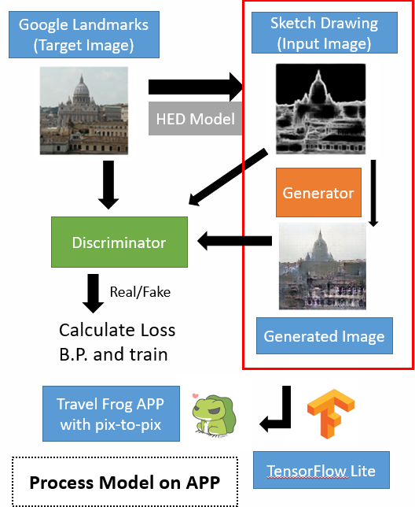
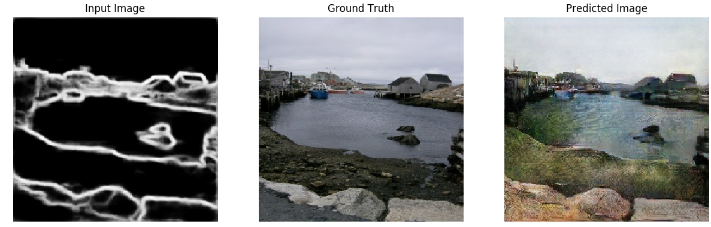

# GAN-Travel-Frog
2020 Google Machine Learning Winter Camp Project. This is an Android Application using **CGAN** model for the Travel Frog game. This Repo mainly contains four parts :

+ ```App``` : A Travel Frog Game based on Android Studio, using **TensorFlow Lite 2.0** to convert a tflite model , and interpret pretrained generator model on mobile phones.

+ ```pix2pix.py``` : Our main model. A **Conditional Generative Adversarial Net** used for generating pictures based on sketch pictures.

+ ```HEDModel/``` : A pretrained Holistically-nested edge detection Model (**HED**) , used to generate dataset

+ ```Others``` : Other files for small tasks such as testing and data preprocessing, etc

  + ```genPic.py``` to generate predicted image by saved generator model

  + ```func_test.py``` to test pix2pix functions and model

  + ```split.py``` to split dataset into training and testing set

  + ```concat.py``` to concatenate sketch pic and real pic together for input data.
  
  + ```convert.py``` to convert saved model into tflite model
  
  + ```testLite.py``` to test for converted tflite model
  
    

### Our Model 




### Process Dataset

+ Download some pictures of landmarks/buildings (For example, [Google Landmarks Dataset](https://www.kaggle.com/google/google-landmarks-dataset)). 

+ Use pretrained HED model to generate sketch pictures (See ```HEDModel/readme.md``` for details)
+ Use ```concact.py``` / ```split.py``` to sort out training/testing dataset

After preprocessing the input data. It should be like this structure:

``````
├─pix2pix.py
└─dataset
    ├─train
    │  └─*.jpg
    └─test
       └─*.jpg
``````

Every ```*.jpg``` should be a picture of the form of $$2W \times H$$,  with the left part $W\times H$ contains a subpicture of Real Image, and the right part  $W\times H$ contains corresponding sketch Image.


### Training

Usage and optional arguments

``````bash
python pix2pix.py [args]
  -h, --help       show help message and exit
  --epoch EPOCH    Training epoch, default = 150
  --glr GLR        generate learning rate, default = 2e-4
  --dlr DLR        discriminator learning rate, default = 2e-4
  --gbeta GBETA    beta 1 of generator adam optimizer, default = 0.5
  --dbeta DBETA    beta 1 of discriminator adam optimizer, default = 0.5
  --batch BATCH    batch size, default = 16
  --buffer BUFFER  buffer size, default = 400
  --w W            Image width, default = 300
  --h H            Image height, default = 300
  --load           whether load from the latest checkpoint, default = false
``````


### Testing

After Each epoch of training, we will randomly pick one picture from test dataset and run our model again. The result will be saved into ```pictures/test_[epochNum].png```. An example result is as below :




#### Conclusion and Results

See [Our Poster](pic/Poster.pdf) for detailed conclusion and result


### Save Model to TensorFlow Lite

Transform the generator model to TensorFlow Lite and put it into ```app/src/assets``` to run model on the Travel Frog Application. You can also use our pretrained model.


### Run the Application

Use ```Android Studio``` to build the app. You can also download our apk. Have Fun and create wonderlands for your cute Travel Frog !


#### Reference

[[1] Xie, Saining, and Zhuowen Tu. "Holistically-nested edge detection." Proceedings of the IEEE international conference on computer vision. 2015.](http://openaccess.thecvf.com/content_iccv_2015/papers/Xie_Holistically-Nested_Edge_Detection_ICCV_2015_paper.pdf)

[[2] Isola, Phillip, et al. "Image-to-image translation with conditional adversarial networks." Proceedings of the IEEE conference on computer vision and pattern recognition. 2017](https://arxiv.org/pdf/1611.07004.pdf).

[[3] TensorFlow Core Tutorials: Pix2pix](https://www.tensorflow.org/tutorials/generative/pix2pix)

[[4] Github Repo: ashukid/hed-edge-detector ](https://github.com/ashukid/hed-edge-detector)

[[5] TensorFlow Lite Guide](https://www.tensorflow.org/lite/guide)


#### Arthurs

- Enhsien Chou, Tsinghua University, Department of Computer Science and Technology
- Ying Chen, Tsinghua University, Department of Computer Science and Technology
- Zhexin Zhang, Tsinghua University, Department of Computer Science and Technology


#### Acknowledgement

Special Thanks to **Google Beijing** for holding the ML camp, providing GCP platform and giving technical help.

